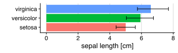
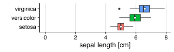
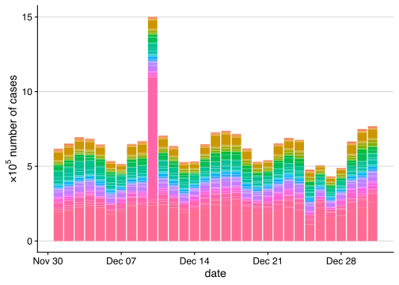
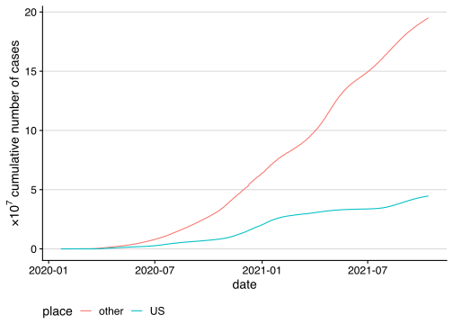
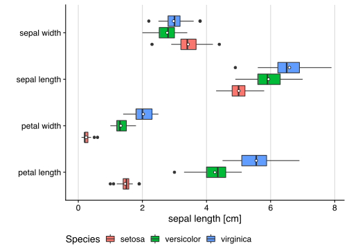
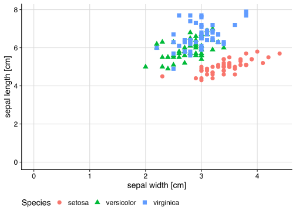
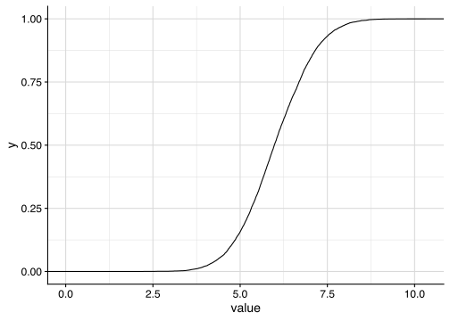

Data Visualization Examples
================

-   [General Tips and Tricks](#general-tips-and-tricks)
-   [Setup for plotting in R](#setup-for-plotting-in-r)
-   [Plot Types](#plot-types)
    -   [Bar chart](#bar-chart)
    -   [Box plot](#box-plot)
-   [Probability Distribution Plots](#probability-distribution-plots)

If the repository does not contain the plot type you need, please
consider submitting a pull request to add it.

# General Tips and Tricks

1.  Prefer horizontal layout over vertical layouts. Differences in width
    are easier to perceive than differences in height.
2.  Show the variability in your results. Results are rarely perfectly
    consistent.
3.  [Label your axis](https://xkcd.com/833/).
4.  include the unit in the axis label (e.g., `[s]` for seconds).
5.  Avoid large numbers on axis labels (e.g., use `1 MB`, not
    `1000 KB`).
6.  Make sure your axes starts at 0 to fairly represent the differences
    in values.
7.  Use the right amount of grid lines. Choose to use major and/or minor
    grid lines depending on your plot. Too many grid lines clutters the
    plot. Too few grid lines makes the plot hard to read.

# Setup for plotting in R

The code snippets shown on this page require one or more of the
libraries imported below.

``` r
library(tidyverse)      # import ggplot, dplyr, readr, etc.
library(data.table)     # data analysis
library(zoo)            # for working with time series data

library(coronavirus)    # dataset for example plots

theme_set(theme_bw())   # set black and white theme for plots.
library(gghighlight)    # for highlighting in plots
library(cowplot)        # convenience functions for plotting

library(knitr)          # literate programming library

# saves plot and removes surrounding whitespace
saveplot <- function(filename, ...) {
  ggsave2(filename, ...)
  knitr::plot_crop(filename)
}
```

# Plot Types

## Bar chart

``` r
 # load data set
iris %>%
  # group by species for summary on next line
  group_by(Species) %>%
  # calculate the arithmetic mean and the 5th and 95th percentile
  summarize(
    length = mean(Sepal.Length),
    p5 = quantile(Sepal.Length,0.05),
    p95 = quantile(Sepal.Length, 0.95)) %>%
  # plot data. 'fill=Species' adds the colors
  ggplot(aes(y=length, x=Species, fill=Species)) +
  # create bar chart where data contains value to plot (mean, 5th percentile, 95th percentile)
  geom_col() +
  # add whiskers with 5th percentile and 95th percentile
  geom_errorbar(aes(ymin=p5, ymax=p95), width=.4) +
  # make sure plot starts at 0 cm
  ylim(0,NA) +
  # add pretty axis labels
  labs(x= "", y="sepal length [cm]") +
  # modify plot theme
  theme_half_open() +
  # add major grid lines on the horizontal axis
  background_grid(major = "x") +
  # remove legend
  theme(legend.position = "none") +
  # make bars horizontal, not vertical
  coord_flip()
```

<!-- -->

Bar charts are useful for comparing scalar values such as the makespan
of a workload when using different schedulers, or the latency of request
for different network configurations. However, when there is variability
in your results (i.e., rerunning your experiments results in different
values), consider using a [box plot](#box-plot).

We plot the sepal length for all flowers in our data. The vertical axis
shows the different flower types, and the horizontal axis shows the
average sepal length, as well as the 5th and 95th percentiles.

## Box plot

``` r
# load data set
iris %>%
  # plot data. 'fill=Species' adds the different colors
  ggplot(aes(y=Sepal.Length, x=Species, fill=Species)) +
  # create box plot
  geom_boxplot() +
  # calculate the arithmetic mean, for each species. Show in plot using a white circle with black border
  stat_summary(fun=mean, geom="point", shape=21, size=2, color="black", fill="white") +
  # make sure the horizontal axis starts at 0
  ylim(0,NA) +
  # add pretty labels
  labs(x= "", y="sepal length [cm]") +
  # set plot theme
  theme_half_open() +
  # add major grid lines for horizontal axis
  background_grid(major = "x") +
  # remove legend
  theme(legend.position = "none") +
  # make boxes horizontal, not vertical
  coord_flip()
```

<!-- -->

Whenever your scalar results show variability, it is good practice to
consider using a box plot. The box plot is generally better at showing
variability than a bar chart with whiskers because a box plot shows more
(well known) statistical properties. The black line inside each box
shows the median value, while the left and right side of the box show
the 25th and 75th percentile respectively. Just as with the bar chart,
the meaning of the whiskers in a box plot can vary. Typically, the
whiskers extend to values that are within 1.5 times the *inter-quartile
range* (IQR), i.e., within 1.5 times the width of the box. Values
outside this range are outliers and are typically depicted individually
as dots (in black). Alternative uses of the whiskers include, but are
not limited to, the 5th and 95th percentile, and the minimum and maximum
value.

Although the box plot shows several useful statistical properties, it
does not show the commonly reported arithmetic mean (i.e., *average*) of
a distribution. Unfortunately, there is no standardized way of showing
the mean in a box plot. We find that a simple marker, distinctly
different from the type of marker used for outliers, typically works
well. In the example above we use a white dot with a black border to
indicate the mean.

# Probability Distribution Plots

``` r
iris %>%
  ggplot(aes(x=Sepal.Length, fill="")) +
  geom_histogram(binwidth = 0.1) +
  labs(x= "sepal length [cm]", y="count") +
  theme_half_open() +
  xlim(0, NA) +
  background_grid(major = "xy") +
  theme(legend.position = "none")
```

    ## Warning: Removed 1 rows containing missing values (geom_bar).

<!-- -->

``` r
saveplot("histogram1.pdf", height = 2, width = 3)
```

    ## Warning: Removed 1 rows containing missing values (geom_bar).

    ## [1] "histogram1.pdf"

``` r
iris %>%
  ggplot(aes(x=Sepal.Length, fill="")) +
  geom_density() +
  labs(x= "sepal length [cm]", y="") +
  theme_half_open() +
  xlim(0, NA) +
  background_grid(major = "xy") +
  theme(legend.position = "none")
```

<!-- -->

``` r
saveplot("pdf1.pdf", height = 2, width = 3)
```

    ## [1] "pdf1.pdf"

``` r
iris %>%
  mutate(a = 1) %>%
  ggplot(aes(x=Sepal.Length, fill=a)) +
  stat_ecdf(geom = "step") +
  labs(x= "length [cm]", y="fraction") +
  theme_half_open() +
  xlim(0, NA) +
  background_grid(major = "xy") +
  theme(legend.position = "none")
```

<!-- -->

``` r
saveplot("cdf1.pdf", height = 2, width = 3)
```

    ## [1] "cdf1.pdf"

``` r
df <- data.frame(value = rnorm(10000, 6, 1))

df %>%
  ggplot(aes(x=value)) +
  geom_histogram(binwidth = .2, color="black", fill = "white") +
  theme_half_open() +
  xlim(0, NA) +
  background_grid(major = "y") +
  theme(legend.position = "none")
```

    ## Warning: Removed 1 rows containing missing values (geom_bar).

<!-- -->

``` r
saveplot("pdf2.pdf", height = 2, width = 3)
```

    ## Warning: Removed 1 rows containing missing values (geom_bar).

    ## [1] "pdf2.pdf"

``` r
df %>%
  ggplot(aes(x=value)) +
  stat_ecdf(geom = "step") +
  theme_half_open() +
  xlim(0, NA) +
  background_grid(major = "xy", minor= "xy") +
  theme(legend.position = "none")
```

<!-- -->

``` r
saveplot("cdf2.pdf", height = 2, width = 3)
```

    ## [1] "cdf2.pdf"
